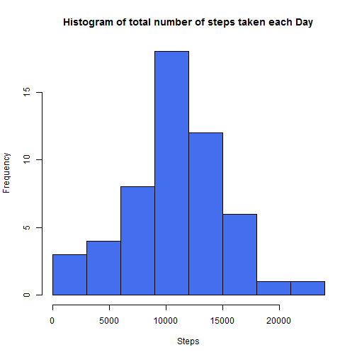
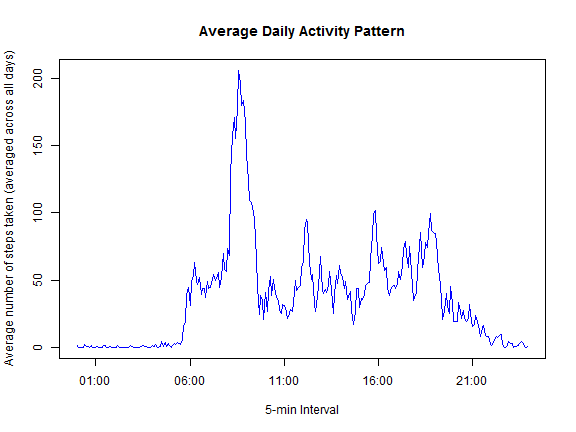
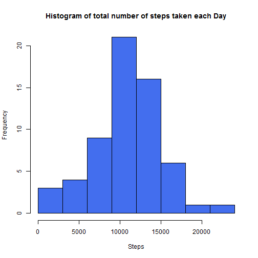
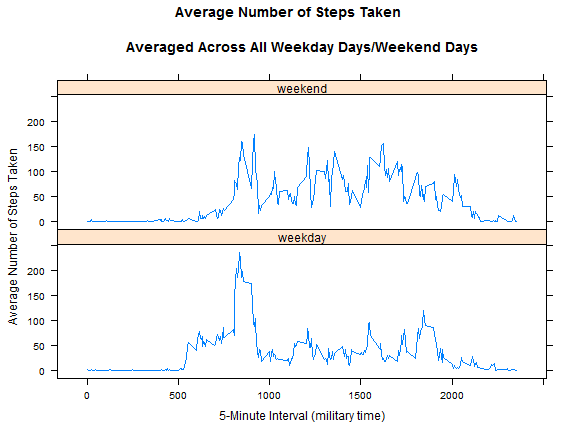

========================================================
Reproducible Research - Peer Assesment 1
========================================================

 

```r
require(lattice)
require(dplyr)
require(magrittr)
```

### Loading and preprocessing the data


```r
temp <- tempfile()
download.file("https://d396qusza40orc.cloudfront.net/repdata%2Fdata%2Factivity.zip",temp)
activity <- read.csv(unz(temp, "activity.csv"))
unlink(temp)
```


```r
#Transform string date to R date using as.Date

activity$date <- as.Date(activity$date)
```


```r
#Calculate the total number of steps taken

stepsPerDay = aggregate(steps~date, activity, sum,na.rm=TRUE)
```

### Plot the Histogram

```r
hist(stepsPerDay$steps, 
     main="Histogram of total number of steps taken each Day",
     xlab = "Steps", 
     breaks=seq(from=0, to=24000, by=3000),
     col="royalblue2")
```



### What is mean total number of steps taken per day?


```r
# Calculate the mean and median of the total number of steps taken each day
mean.StepsPerDay <- mean(stepsPerDay$steps)
mean.StepsPerDay
```

```
## [1] 10766.19
```

```r
median.StepsPerDay <- median(stepsPerDay$steps)
median.StepsPerDay
```

```
## [1] 10765
```

### The average daily activity pattern

```r
five.min.avg <- aggregate(steps~interval, data=activity, FUN=mean, na.rm=TRUE)
five.min.avg$interval  <- as.POSIXct(strptime(sprintf("%04d", five.min.avg$interval), "%H%M"))

plot(x = five.min.avg$interval, y = five.min.avg$steps, 
      type = "l", 
      col="blue",
      xlab="5-min Interval", 
      ylab="Average number of steps taken (averaged across all days)",
      main="Average Daily Activity Pattern") 
```



### Which 5-minute interval, on average across all the days in the dataset, contains the maximum number of steps?


```r
max_index = which(five.min.avg$steps == max(five.min.avg$steps))

max_interval = strftime(five.min.avg[max_index, 1], format="%H:%M")
```

The 5-minute interval that contains the maximum of steps, on average across all days, is

```r
max_interval
```

```
## [1] "08:35"
```

### Imputing missing Values.


1. Calculate and report the total number of missing values in the dataset.  


```r
missing <- sum(is.na(activity$steps))
```

The number of missing observations is

```r
print(missing)
```

```
## [1] 2304
```

2. Find the observations that has NA value


```r
na.rows <- which(is.na(activity$steps))
```

### Imputing strategy

We will impute the values by filling in the mean of the steps in each interval for that Weekday.

To impute, we subgroup the data by Weekday and Interval and fill in any missing values with the average for that particular Interval/Weekday combination 


```r
aggdata <- aggregate(activity$steps, by=list(weekdays(activity$date), activity$interval), FUN=mean, na.rm=TRUE)

aggdata[,3] = round(aggdata[,3],0)
names(aggdata) = c("dayoftheweek", "interval", "steps")
```


```r
#Take a look at the average number of steps for each interval by day of the week
head(aggdata)
```

```
##   dayoftheweek interval steps
## 1       Friday        0     0
## 2       Monday        0     1
## 3     Saturday        0     0
## 4       Sunday        0     0
## 5     Thursday        0     6
## 6      Tuesday        0     0
```

 

3. Create a new dataset that is equal to the original dataset but with imputing the missing data

```r
imputed <- activity
for (i in na.rows)
{
  imputed[i,1] = aggdata[ aggdata$dayoftheweek == weekdays(activity$date[i]) 
             & aggdata$interval == activity$interval[i],3]
}
```


```r
#Make sure that we imputed all the values and there are NA values 
missing <- sum(is.na(imputed$steps))
print(missing)
```

```
## [1] 0
```

4. Make a histogram of the total number of steps taken each day and Calculate and report the mean and median total number of steps taken per day. 


```r
#Calculate the total number of steps taken
stepsPerDay = aggregate(steps~date, imputed, sum,na.rm=TRUE)
```

### Plot the Histogram with imputed values.

```r
hist(stepsPerDay$steps, 
     main="Histogram of total number of steps taken each Day",
     xlab = "Steps", 
     breaks=seq(from=0, to=24000, by=3000),
     col="royalblue2")
```




```r
#Calculate the mean and median of the total number of steps taken each day
mean.StepsPerDay <- mean(stepsPerDay$steps)
median.StepsPerDay <- median(stepsPerDay$steps)
```

Do these values differ from the estimates from the first part of the assignment? What is the impact of imputing missing data on the estimates of the total daily number of steps?


```r
print(median.StepsPerDay)
```

```
## [1] 11015
```

```r
print(mean.StepsPerDay)
```

```
## [1] 10821.1
```

These values are slightly higher  from median/mean values with missing observations. The impact of imputing the missing values is to have more data, resulting in a slightly higher mean and median values.

### Are there differences in activity patterns between weekdays and weekends?

1. Create a new factor variable in the dataset with two levels - "weekday" and "weekend" indicating whether a given date is a weekday or weekend day.


```r
imputed <- data.frame(date=imputed$date, 
                           weekday=tolower(weekdays(imputed$date)), 
                           interval=imputed$interval,
                           steps=imputed$steps)

# Categorize  the day type (weekend or weekday)

imputed <- cbind(imputed, 
                      daytype=ifelse(imputed$weekday == "saturday" | 
                             imputed$weekday == "sunday","weekend", "weekday"))
```

2. Make a panel plot containing a time series plot of the 5-minute interval (x-axis) and the average number of steps taken, averaged across all weekday days or weekend days (y-axis).


```r
# Compute the average number of steps taken, averaged across all daytype variable

 ww <- imputed %>%
    group_by(daytype, interval) %>%
    summarise(avg.steps = mean(steps, na.rm = TRUE))

# plot the time series data
 xyplot(avg.steps ~ interval | factor(daytype), data=ww, 
       type = 'l',
       layout=c(1,2),
       scales=list(alternating=FALSE),
       main="Average Number of Steps Taken\n 
       Averaged Across All Weekday Days/Weekend Days",
       xlab="5-Minute Interval (military time)",
       ylab="Average Number of Steps Taken")
```



 Observations:

1. From this plot, one can clearly see that there is adifference in activity pattern between weekdays and weekends. The plot indicates that the person  is more active  between 8:15AM and 8:45AM on weekdays as indicated by the big spike.
  

2. On the Weekends, activity is more sluggish (compared to weekdays) until around 8:00AM, but there is more activity during the day on average.  

3. Activity has almost stopped on Weekdays by 8:00PM , while Weekends show surges of activity until 9:30PM.
